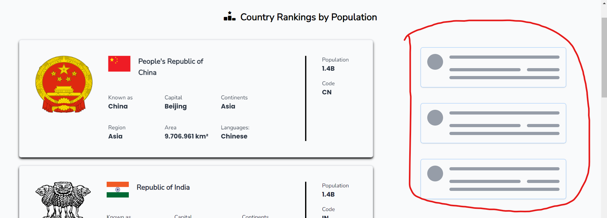
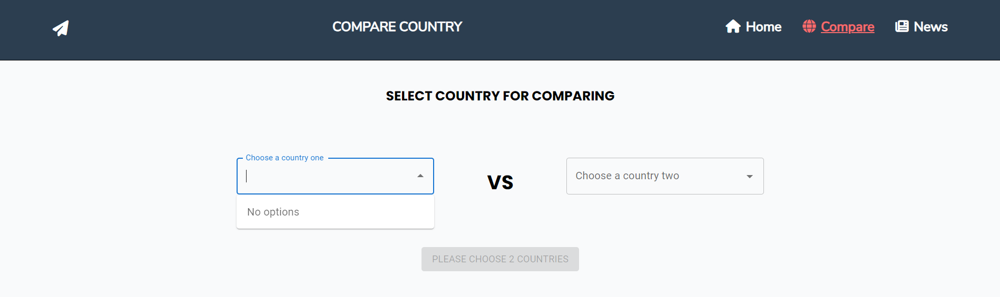

# Country Comparison & News App 🌍🌎🌏

This is an all-in-one app where you can see the order of countries by population. Then you can also compare between 2 countries and finally you can read the latest news from the country.

## Authors 👨‍💻

- [@Muhammad Ali Akbar](https://github.com/aliakb13)

## Table of Contents 📜

- [Features](#features)
- [Tech Stack](#Tech-Stack)
- [Environment Variables](#Environment-Variables)
- [Installation](#installation)
- [FAQ](#FAQ)

## Features ✨

- Load more button
- Compare Country
- Skeleton loading
- Country news

## Tech Stack 🚀

**Client:** React, Redux, TailwindCSS, Material UI, React Router, Axios

**API:** [REST Countries](https://restcountries.com/), [nytimes dev](https://developer.nytimes.com/)

**Bundler:** ViteJS

## Font and Icons 📚

- [**Font Awesome**](https://fontawesome.com/)
- [**Google Font**](https://fonts.google.com/)

## Environment Variables

To run this project, you will need to add the following environment variables to your .env file or you can check on .env.example

`VITE_API_NYT_KEY=YOURAPIKEY`

## Installation 🔨

Install my-project with npm

### 1. Clone the repository:

```bash
git clone https://github.com/aliakb13/country-comparison-app.git
```

### 2. Navigate to the project directory:

```bash
cd country-comparison-app
```

### 3. Install Dependencies

```bash
npm install
```

### 4. Set up Environment Variables

Create a .env file in the root directory and add the required environment variables. Or you can just change the .env.example in root folder of the project

### 5. Run the application:

```bash
npm run dev
or
npm run build
```

## FAQ ⁉️

#### Why is it that when the website is opened for the first time, I find that the news sidebar on the right keeps loading. Is this because of my connection?



There's nothing wrong with your connection. Rather, you should move the page to **news** because the process of retrieving data occurs there. Then you can go back to the home page and see that the news data displayed will be the same.

#### Why is it that when I directly open the page with the destination “/compare”, the list of countries to compare becomes empty?



Try opening the web page again and make sure that you have opened the **home** page before entering **“/compare”.**

### Feedback

This all happens as a result of the website mechanism that has been created. I as the developer apologize for this inconvenience, I will fix it next time.

If you find any other errors or incompatibilities, please let us know by opening an **issue** in this repository.

## Demo 🎞️

You can open this website by clicking the following link https://country-comparison-murex.vercel.app/
